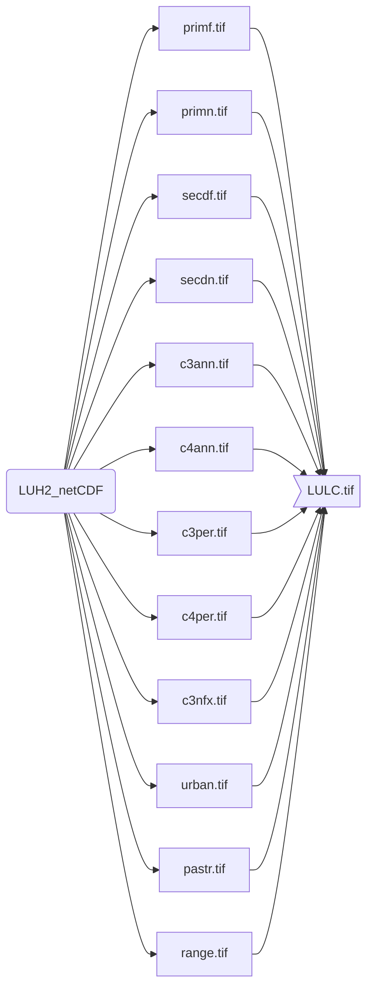

```mermaid
graph LR
A(<font size=3>LUH2_netCDF) --> B[<font size=3>primf.tif]
    A --> C[<font size=3>primn.tif]
    A --> D[<font size=3>secdf.tif]
    A --> E[<font size=3>secdn.tif]
    A --> F[<font size=3>c3ann.tif]
    A --> G[<font size=3>c4ann.tif]
    A --> H[<font size=3>c3per.tif]
    A --> I[<font size=3>c4per.tif]
    A --> J[<font size=3>c3nfx.tif]
    A --> L[<font size=3>urban.tif]
    A --> M[<font size=3>pastr.tif]
    A --> N[<font size=3>range.tif]
    B --> O><font size=3>LULC.tif]
    C --> O><font size=3>LULC.tif]
    D --> O><font size=3>LULC.tif]
    E --> O><font size=3>LULC.tif]
    F --> O><font size=3>LULC.tif]
    G --> O><font size=3>LULC.tif]
    H --> O><font size=3>LULC.tif]
    I --> O><font size=3>LULC.tif]
    J --> O><font size=3>LULC.tif]
    L --> O><font size=3>LULC.tif]
    M --> O><font size=3>LULC.tif]
    N --> O><font size=3>LULC.tif]
```

