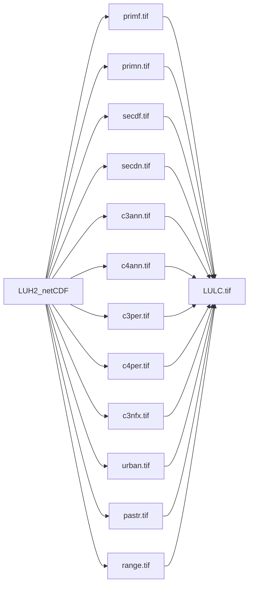

```mermaid
graph LR
A[LUH2_netCDF] --> B[primf.tif]
    A --> C[primn.tif]
    A --> D[secdf.tif]
    A --> E[secdn.tif]
    A --> F[c3ann.tif]
    A --> G[c4ann.tif]
    A --> H[c3per.tif]
    A --> I[c4per.tif]
    A --> J[c3nfx.tif]
    A --> L[urban.tif]
    A --> M[pastr.tif]
    A --> N[range.tif]
    B --> O[LULC.tif]
    C --> O[LULC.tif]
    D --> O[LULC.tif]
    E --> O[LULC.tif]
    F --> O[LULC.tif]
    G --> O[LULC.tif]
    H --> O[LULC.tif]
    I --> O[LULC.tif]
    J --> O[LULC.tif]
    L --> O[LULC.tif]
    M --> O[LULC.tif]
    N --> O[LULC.tif]
```
