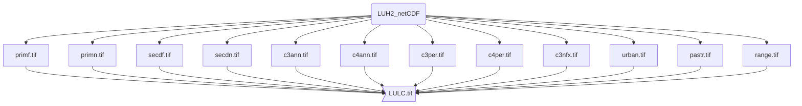

# LUH2 data Standart Gis Format

## Welcome and thanks for visiting this repository!

## A brief introduction about the product:
##### The World Climate Research Programme (WCRP, site________) is the main organization that adresses quetions related to the coupled climate system, providing many products of past, present and future climatic and land cover global conditions. Several initiatives redistribute this data according to their needs and demands as Wordclim (______), Paleoclim (______), Ecoclimate (____) and others.

##### The Land use Harmonization Project (Site________) provide a dataset of harmonized set of land-use scenarios that smoothly connects the historical reconstructions of land-use with the future projections in the format required for Earth System Models (ESM) based on produtc of WCRP. The data is global with spatial resolution of ~ 50 km, cover years from 850-2300 and including land use states, transitions and mgt layers, for more detail about the data please see Hurt et al 2006, 2011 and README of product  available in : https://gsweb1vh2.umd.edu/LUH2/LUH2_v2f_README_v6.pdf 

##### Here we built a R scripts to conversition the "States" netcdf files in tif format that is commoly used in GIS and other important analyisis as SDMs or Ecological N iche Models and create a New categoriccal  data. We follow 3 steps 1- extract one by one of twelve states per year from 850 to 2100 and for two future scenarios (RCP 4.5/SSP2 and RCP 8.5/SSP5). 2- Save each single state, which is a continuous data as a TIF format and 3- we created a New data that is Lad use land cover data with 12 states. 

The raw data is available in download page of Land Use Hamornization projetc  (LUH2, https://luh.umd.edu/data.shtml ). Also it's the data of CMPI6 (The latestet version of models earth system _______). We extrated   conversion them in a single layer in tif file. 

## States:
##### primf: forested primary land
##### primn: non-forested primary land
##### secdf: potentially forested secondary land
##### secdn: potentially non-forested secondary land
##### pastr: managed pasture
##### range: rangeland
##### urban: urban land
##### c3ann: C3 annual crops
##### c3per: C3 perennial crops
##### c4ann: C4 annual crops
##### c4per: C4 perennial crops
##### c3nfx: C3 nitrogen-fixing crops

## NEW

